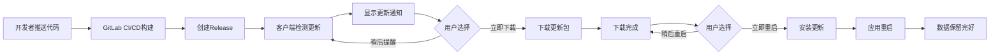

# AEGIS套利系统部署指南

## 📋 目录
1. [系统架构](#系统架构)
2. [环境准备](#环境准备)
3. [GitLab配置](#gitlab配置)
4. [本地开发](#本地开发)
5. [版本发布](#版本发布)
6. [自动更新流程](#自动更新流程)
7. [数据持久化](#数据持久化)
8. [常见问题](#常见问题)

---

## 系统架构

### 技术栈
- **前端**: Vue 3.5 + Vite 6 + Tailwind CSS 4
- **后端**: Bun + Hono + SQLite
- **桌面**: Electron + electron-builder
- **CI/CD**: GitLab CI/CD
- **存储**: electron-store (本地持久化)

### 目录结构
```
polymarket/new/
├── backend/           # 后端服务
├── frontend/          # Vue前端应用
├── desktop/           # Electron桌面客户端
│   ├── electron/      # 主进程和预加载脚本
│   ├── services/      # 数据存储服务
│   └── updater/       # 自动更新服务
├── scripts/           # 构建和发布脚本
├── .gitlab-ci.yml     # GitLab CI/CD配置
└── docker-compose.yml # Docker部署配置
```

---

## 环境准备

### 1. 开发环境要求
- **Node.js**: >= 20.x
- **Bun**: >= 1.0
- **Git**: >= 2.x
- **系统**: macOS / Windows 10+

### 2. 安装依赖

```bash
# 安装Bun（如未安装）
curl -fsSL https://bun.sh/install | bash

# 克隆仓库
git clone http://121.41.231.194:10886/wangqi/aegis-arbitrage.git
cd aegis-arbitrage/new

# 安装后端依赖
cd backend && npm install

# 安装前端依赖
cd ../frontend && npm install

# 安装桌面客户端依赖
cd ../desktop && npm install
```

### 3. 环境变量配置

创建 `.env` 文件：

```bash
# GitLab配置
GITLAB_URL=http://121.41.231.194:10886
GITLAB_PROJECT=wangqi/aegis-arbitrage
GITLAB_TOKEN=your-gitlab-token

# 数据加密密钥
ENCRYPTION_KEY=your-encryption-key

# 后端配置
BACKEND_PORT=7700

# API密钥（可选）
POLYMARKET_API_KEY=
KALSHI_API_KEY=
OPENAI_API_KEY=
```

---

## GitLab配置

### 1. 创建GitLab仓库

```bash
# 登录GitLab
# URL: http://121.41.231.194:10886
# 用户名: wangqi
# 密码: wq123456

# 创建新项目: aegis-arbitrage
```

### 2. 配置GitLab Runner

需要配置两个Runner用于构建：
- **Windows Runner**: 构建Windows客户端
- **macOS Runner**: 构建macOS客户端

```bash
# 在构建机器上安装GitLab Runner
# macOS
brew install gitlab-runner

# Windows
# 下载并安装: https://docs.gitlab.com/runner/install/windows.html

# 注册Runner
gitlab-runner register
# URL: http://121.41.231.194:10886
# Token: 从GitLab项目设置中获取
# Tags: macos, electron (或 windows, electron)
```

### 3. 配置CI/CD环境变量

在GitLab项目中设置以下环境变量：
- `Settings` → `CI/CD` → `Variables`

```
GITLAB_TOKEN: your-gitlab-token
ENCRYPTION_KEY: your-encryption-key
```

---

## 本地开发

### 1. 启动后端服务

```bash
cd backend
npm run dev
# 或使用Bun
bun run dev
```

后端服务将在 `http://localhost:7700` 启动

### 2. 启动前端应用

```bash
cd frontend
npm run dev
```

前端应用将在 `http://localhost:5173` 启动

### 3. 启动桌面客户端

```bash
cd desktop
npm run dev
```

这会启动Electron应用，自动加载 `localhost:5173` 的前端页面

### 4. 测试完整流程

```bash
# 终端1: 启动后端
cd backend && npm run dev

# 终端2: 启动前端
cd frontend && npm run dev

# 终端3: 启动桌面客户端
cd desktop && npm run dev
```

---

## 版本发布

### 1. 版本号管理

使用语义化版本（SemVer）：
- **patch**: 修复bug（1.0.0 → 1.0.1）
- **minor**: 新增功能（1.0.0 → 1.1.0）
- **major**: 重大变更（1.0.0 → 2.0.0）

### 2. 发布流程

```bash
# 确保工作目录干净
git status

# 提交所有更改
git add .
git commit -m "feat: 添加新功能"

# 更新版本号（自动创建tag）
npm run version:patch   # 或 minor / major

# 推送到GitLab（触发自动构建）
git push origin main
git push origin v1.0.1  # 替换为实际版本号
```

### 3. 自动化构建

推送tag后，GitLab CI/CD会自动：
1. ✅ 运行测试
2. 🔨 构建Windows和macOS客户端
3. 📦 打包为安装包（.exe、.dmg）
4. 🚀 创建GitLab Release
5. 📤 上传安装包和更新清单

### 4. 手动构建（可选）

```bash
# 构建所有平台
cd desktop
npm run build:all

# 或单独构建
npm run build:win   # Windows
npm run build:mac   # macOS

# 构建产物在 desktop/dist-electron/
```

---

## 自动更新流程

### 客户端自动更新原理



### 更新检测时机
1. **应用启动**: 启动5秒后检查一次
2. **定时检查**: 每2小时检查一次
3. **手动检查**: 用户点击"检查更新"按钮

### 更新清单文件
- Windows: `latest.yml`
- macOS: `latest-mac.yml`

文件位置：
```
http://121.41.231.194:10886/wangqi/aegis-arbitrage/-/releases/permalink/latest/downloads/latest.yml
```

### 客户端配置

在 `desktop/updater/autoUpdater.js`:
```javascript
const gitlabUrl = process.env.GITLAB_URL || 'http://121.41.231.194:10886';
const projectPath = process.env.GITLAB_PROJECT || 'wangqi/aegis-arbitrage';

autoUpdater.setFeedURL({
  provider: 'generic',
  url: `${gitlabUrl}/${projectPath}/-/releases/permalink/latest/downloads`
});
```

---

## 数据持久化

### 数据存储位置

客户端数据使用 `electron-store` 存储在本地：

- **macOS**: `~/Library/Application Support/AEGIS Arbitrage/aegis-data.json`
- **Windows**: `%APPDATA%\AEGIS Arbitrage\aegis-data.json`

### 存储数据结构

```javascript
{
  // 用户配置
  userConfig: {
    apiKeys: {
      polymarket: "xxx",
      kalshi: "xxx",
      openai: "xxx"
    },
    walletAddress: "0x...",
    privateKey: "encrypted",
    notifications: {
      email: "user@example.com",
      telegram: "@username",
      enableSound: true,
      enableDesktop: true
    }
  },
  
  // 交易策略配置
  strategyConfig: {
    arbitrage: {
      enabled: true,
      minProfitPercentage: 2.0,
      maxInvestment: 1000,
      autoExecute: false
    },
    copyTrading: {
      enabled: false,
      followAddresses: [],
      maxCopyAmount: 500
    }
  },
  
  // 历史数据
  history: {
    trades: [],              // 最近1000条交易
    arbitrageOpportunities: [], // 最近500条套利机会
    profitHistory: []        // 最近365天收益
  },
  
  // 应用状态
  appState: {
    lastLoginTime: 1704067200000,
    windowBounds: { width: 1400, height: 900, x: 100, y: 100 },
    theme: "dark",
    language: "zh-CN"
  },
  
  // 版本信息
  version: {
    dataVersion: "1.0.0",
    lastAppVersion: "1.0.0"
  }
}
```

### 数据API

在前端使用：

```javascript
// 获取API密钥
const apiKeys = await window.electronAPI.data.getApiKeys();

// 保存API密钥
await window.electronAPI.data.saveApiKey('polymarket', 'your-key');

// 获取交易历史
const trades = await window.electronAPI.data.getTradeHistory(100);

// 添加交易记录
await window.electronAPI.data.addTradeRecord({
  platform: 'Polymarket',
  market: 'BTC > $100k',
  amount: 100,
  profit: 5.2
});

// 获取套利配置
const config = await window.electronAPI.data.getArbitrageConfig();

// 保存套利配置
await window.electronAPI.data.saveArbitrageConfig({
  minProfitPercentage: 2.5,
  maxInvestment: 2000
});
```

### 数据备份与恢复

#### 导出数据
1. 点击系统托盘图标
2. 选择"数据管理" → "导出数据"
3. 选择保存位置
4. 数据将导出为JSON文件

#### 导入数据
1. 点击系统托盘图标
2. 选择"数据管理" → "导入数据"
3. 选择之前导出的JSON文件
4. 确认导入（会覆盖当前数据）
5. 建议重启应用

### 数据迁移

版本升级时，数据会自动迁移：

```javascript
// 在 dataStore.js 中配置迁移规则
migrations: {
  '1.0.0': store => {
    // 初始版本
  },
  '1.1.0': store => {
    // 添加通知配置
    const config = store.get('userConfig', {});
    if (!config.notifications) {
      config.notifications = { /* 默认配置 */ };
      store.set('userConfig', config);
    }
  }
}
```

### 数据加密

敏感数据（如私钥）使用加密存储：

```javascript
// 初始化时提供加密密钥
dataStore.initialize(process.env.ENCRYPTION_KEY);
```

---

## 常见问题

### Q1: 客户端更新失败怎么办？

**原因**: 网络问题或服务器无法访问

**解决**:
1. 检查网络连接
2. 确认GitLab服务器可访问：`http://121.41.231.194:10886`
3. 手动下载安装包重新安装
4. 查看日志：`~/.config/AEGIS Arbitrage/logs/main.log`

### Q2: 数据丢失怎么办？

**原因**: 应用数据被意外删除

**解决**:
1. 检查数据存储位置是否存在
2. 使用备份的JSON文件恢复
3. 如果有，从其他设备同步数据

**预防**:
- 定期导出数据备份
- 使用云同步工具备份 Application Support 目录

### Q3: 后端服务启动失败？

**原因**: 端口被占用或依赖缺失

**解决**:
```bash
# 检查端口占用
lsof -i :7700

# 重新安装依赖
cd backend
rm -rf node_modules
npm install

# 检查Bun是否安装
bun --version
```

### Q4: 构建失败怎么办？

**原因**: 依赖问题或环境配置错误

**解决**:
```bash
# 清理缓存
cd desktop
rm -rf node_modules dist-electron
npm install

# 检查构建环境
npm run build:mac -- --dir  # 测试构建
```

### Q5: GitLab CI/CD不触发？

**原因**: Runner未正确配置或tag不匹配

**解决**:
1. 检查Runner状态：GitLab项目 → Settings → CI/CD → Runners
2. 确认Runner有正确的tags（`macos`, `electron` 或 `windows`, `electron`）
3. 检查 `.gitlab-ci.yml` 中的 `only` 配置
4. 查看Pipeline日志：GitLab项目 → CI/CD → Pipelines

### Q6: 如何修改更新检查频率？

编辑 `desktop/updater/autoUpdater.js`:
```javascript
// 修改检查间隔（单位：毫秒）
setInterval(() => {
  this.checkForUpdates();
}, 2 * 60 * 60 * 1000); // 当前为2小时
```

### Q7: 如何禁用自动更新？

```javascript
// 在 desktop/electron/main-v2.js 中注释掉自动更新初始化
// autoUpdater = new AutoUpdaterService(mainWindow);
```

---

## 版本历史

### v1.0.0 (2026-02-07)
- ✨ 初始版本发布
- 🎯 实现基于GitLab的自动更新
- 💾 完善的数据持久化机制
- 🖥️ Windows和macOS跨平台支持
- 🔐 加密存储敏感数据
- 📊 实时更新通知UI

---

## 技术支持

- **GitLab**: http://121.41.231.194:10886
- **文档**: 项目Wiki
- **问题反馈**: GitLab Issues

---

## 许可证

Copyright © 2026 AEGIS Team. All rights reserved.
